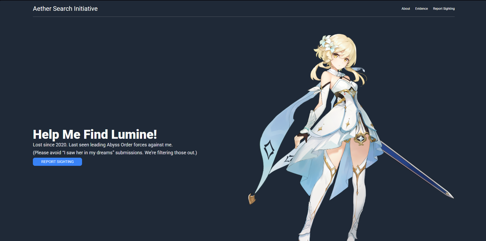

# Landing-page
A satirical, lore-driven landing page themed around Aether’s search for Lumine from Genshin Impact.
Originally built as part of The Odin Project’s Foundations course, this project was extended with a custom narrative, character-based reports, and a light in-universe investigation theme.

The focus is on clean HTML structure, Flexbox layout, maintaining visual hierarchy and Integrating thematic storytelling.

## Live Demo
[View on GitHub Pages](https://sai-eshwar-supreet.github.io/Landing-page/)

## Preview

## Features
- Lore-accurate, character-driven content
- Satirical investigation-style theme
- Responsive layout using Flexbox
- Distinct UI sections for:
  - Hero & call-to-action
  - Character-based evidence reports
  - Quote section
  - Final task-force CTA

## What I Practiced
- Semantic HTML structure
- Flexbox for layout control
- Visual hierarchy and spacing
- Theming a generic layout with narrative content

## Attribution
Images sourced from:
- [PngAAA](https://www.pngaaa.com/)
- [Tier Maker](https://tiermaker.com/)